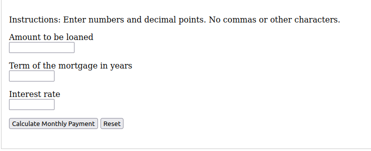
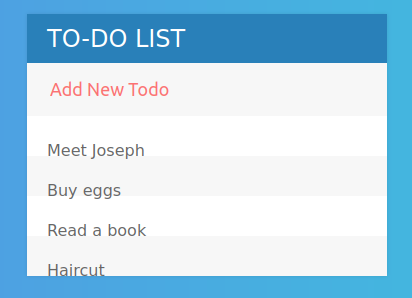

Portfolio
=========

Kevin Holmes

CSCI 496: Senior Portfolio
In partial fulfillment of the requirements for the degree of Bachelor of Technology: Computer Programming 

Programming Projects
--------------------

*For access to my private project repositories, please [email me](mailto:kcholmes@csustudent.net) with the subject line, GitHub Access.

---
### ToDo App CSCI-325

This app provides a convenient and simple way for users to manage their to-do list. It incorporates multiple technologies including Java, JavaFX, and FXML. It was built in a collaborative, team-based environment.

--
### [Mortgage Calculator | CSCI 301](project1)
---

This app calculates a monthly mortgage payment based on the amount to be loaned and the term of the mortgage in years.

https://codepen.io/sc_dev/pen/MWvXbWW

--
### [To-do App | CSCI 301](project1)
---

Web app to-do list written in JQuery, HTML, and CSS.

https://codepen.io/sc_dev/pen/jOLKwea

Ethics Papers
-------------

### [Ethical Issues in Modern Computing](/pdf/ethics_essay.pdf)

-   **Class:** CSCI 496 - Senior Portfolio

### [Reflections Essay](/pdf/reflections_essay.pdf)

-   **Class:** CSCI 496 - Senior Portfolio

---
	
	

Page template forked from <a href="https://github.com/csu-cs/csci-portfolio">CSU-CS</a>

<!-- Remove above link if you don't want to attributive -->
