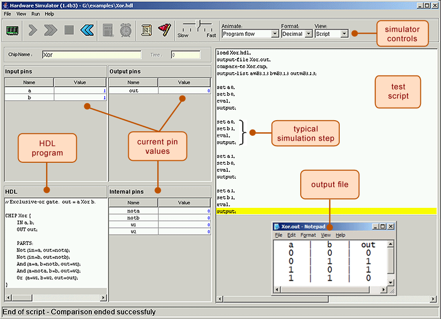
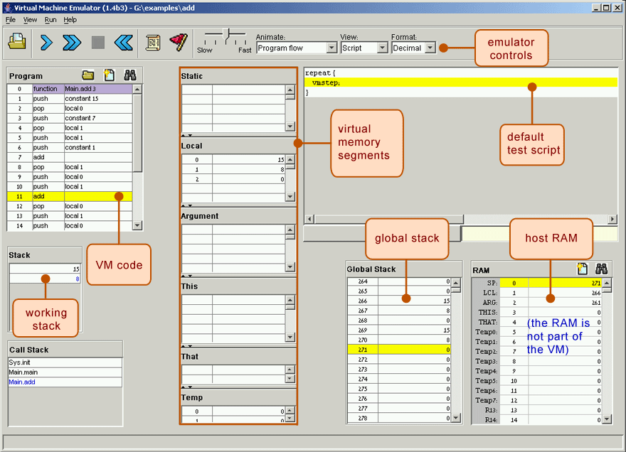
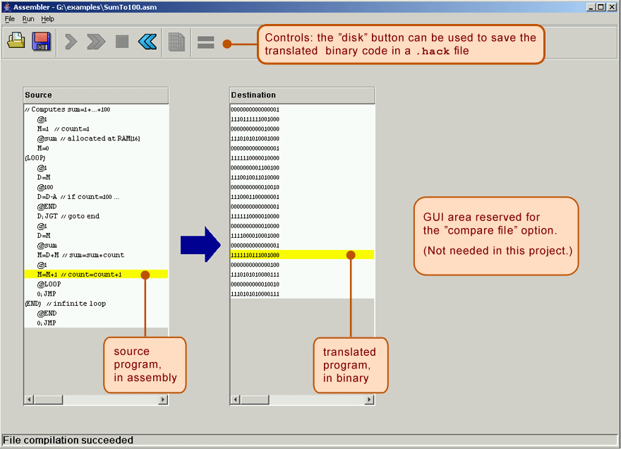

Portfolio
=========

Programming Projects
--------------------

*For access to my private project repositories, please [email me](mailto:kcholmes@csustudent.net) with the subject line, GitHub Access.

---
### ToDo App CSCI-325

This app provides a convenient and simple way for users to manage their to-do list. It incorporates multiple technologies including Java, JavaFX, and FXML. It was built in a collaborative, team-based environment.

---
### Build a Modern Computer from First Principles: From Nand to Tetris (Project-Centered Course) Coursera

In this course, students are required to build a modern computer from scratch using a software-based hardware simulator. It starts from elementary logic gates, and through six hands-on projects you create a general purpose computer. The certifacate of completion I recieved for the course can be viewed [here](https://www.coursera.org/account/accomplishments/verify/6PP5YFSUAKPD).

---

Ethics Papers
-------------

### [Paper 1 Title](/pdf/sample_presentation.pdf)

-   **Class:**  
-   **Grade:**

### [Paper 2 Title](/pdf/sample_presentation.pdf)

-   **Class:** 
-   **Grade:**

### [Paper 3 Title](/pdf/sample_presentation.pdf)

-   **Class:** 
-   **Grade:**

---

Presentations
-------------

### [Presentation 1 Title](/pdf/sample_presentation.pdf)

- **Class:** 
- **Grade:**

### [Presentation 2 Title](/pdf/sample_presentation.pdf)

- **Class:** 
- **Grade:**

---

Page template forked from <a href="https://github.com/csu-cs/csci-portfolio">CSU-CS</a>

<!-- Remove above link if you don't want to attributive -->
