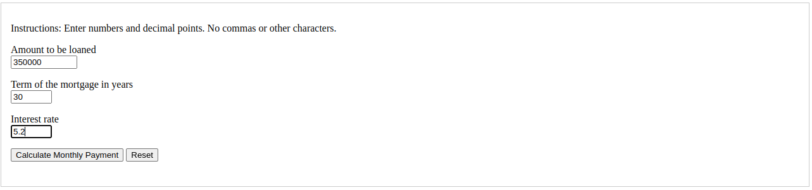
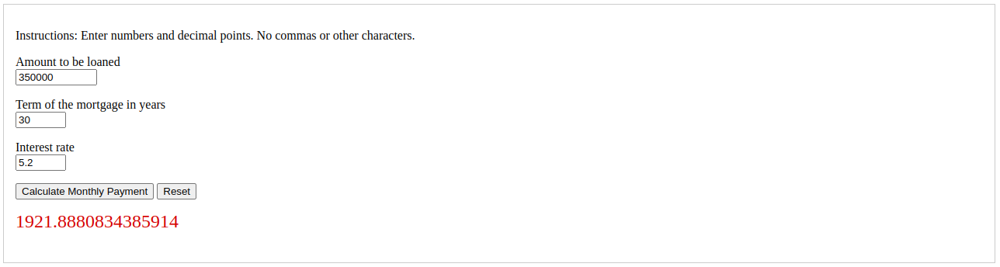

[Back to Portfolio](./)

Project 1 Title
===============

-   **Class:** Survery of Scripting Languages
-   **Language(s):** Javascript, CSS, HTML

## Project description

This app calculates a monthly mortgage payment based on the amount to be loaned and the term of the mortgage in years.

## UI Design

  
Fig 1. The launch screen

  
Fig 2. Inputting data

  
Fig 1. Calculated output

[Back to Portfolio](./)
